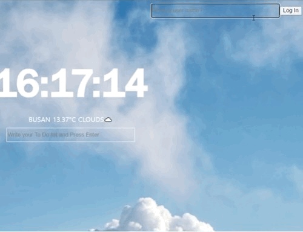
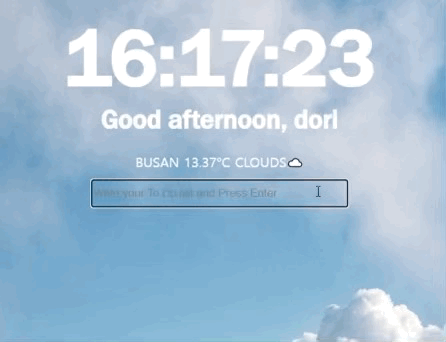
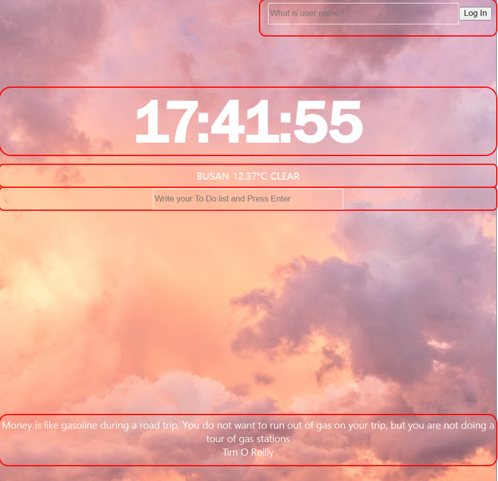
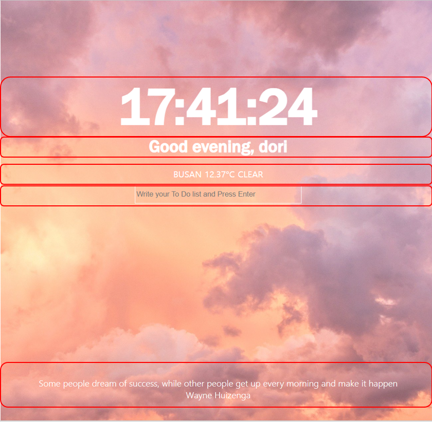

# chrome_home
- javascript로 시계, 할일 목록, 날씨를 구현한 웹 홈페이지

1️⃣ 실행
https://summerydev.github.io/chrome-home/

2️⃣ 사용
vanilla JS

3️⃣ 목차
- 기능
- 구현
- 학습
- 업데이트
---

# 기능
## 반응형 구현
- screen 사이즈에 따라 폰트 사이즈 변경
- 스크롤 방지 기능 추가

## local login
- 로컬 로그인     


## clock & Weather
- `00:00:00`형식의 시계   
- 사용자 위치 조회하여 날씨, 온도 구현  


## To Do List
- 목록에 할일 추가, 삭제    


--- 
# 구현
## 레이아웃


    

## 파일별 기능
### 📁js/app.js
- `onLoginSubmit` : 로그인 폼 처리, 로그인 시 hidden 처리
- `onLogoutSubmit` : 로그아웃 폼 처리, 로그아웃 시 hidden 처리
- `paintGreetings` : username 환영인사 출력
- 미로그인 시 환영인사 hidden처리

### 📁js/background.js
- `selectImg` : 랜덤 배경 이미지 생성
- 일정 시간 기준 `selectImg`실행

### 📁js/clock.js
- `getClock()` : `00:00:00`형식 시간 생성
- 1초 기준 `getClock()`실행

### 📁js/parse.js(미완성)
- `csvToJSON` : csv파일 JSON으로 변환
- 데이터 파일을 html에 출력

### 📁js/quote.js
- 명언 데이터를 배열로 저장, 랜덤 출력

### 📁js/todo.js
- `handleToDoSubmit` : 할일 입력 시 form 처리
- `saveToDos` : form 처리한 할일 localStorage에 저장
- `deleteToDo` : 개별 할일 삭제
- `paintTodo` : localStorage에 저장된 할일 목록 html에 출력
- localStorage에 저장된 할일 반복 출력

### 📁js/weather.js
- onGeoOk : 사용자 위치 정상 조회 시 날씨 생성
- onGeoError : 사용자 위치 조회 불가 시 `alert`

## 구현
## local login, logout
1. `localStorage`에 key:value 형태로 username저장, username 존재 시 loginForm hidden 처리
2. username 존재 시 logoutForm 생성

## clock
1. `00:00:00`형식의 시계
2. `setInterval()`로 초단위 시계 구현

## To Do List
1. 목록에 할일 추가, 삭제, 저장 구현
2. `localStorage`에 key:value 배열 형태로 to Do List 저장
3. 개별 삭제 구현 위해 `Date.now()`로 key마다 id 부여

## Weather
1. 사용자 위치 조회하여 날씨, 온도 구현
2. weather api 사용 : https://openweathermap.org/api
3. `Geolocation`로 사용자 위치 조회, 위치, 온도, 날씨 생성

## random quote, backgroundImgae
1. 명언 랜덤 출력
2. 백그라운드 이미지 일정 시간마다 랜덤 출력

# 학습
## csv파일 JSON으로 파싱
문제
- data에서 quote, author에 `.`,`,` 등 특수문자 포함되어 파싱 오류
- JSON 파싱 후 배열로 리턴 시 오류 발생
- 브라우저 콘솔에서 fs 인식 불가능
- 콘솔에서 js 파일 실행 시 document 인식 불가능

수정
- csv 구분자 `|`로 전처리
- `JSON.stringify()`로 리턴 후 `JSON.parse()`로 다시 파싱

해결방법 고민 및 학습
- node.js와 common js의 차이 이해함
- cdn 및 jQuery 사용으로 html에 구현 고민

## image 추출 코드 변경
문제
- 이미지 배열이 `"0.jpg"`형식의 String으로 추가, 수정의 어려움
- 새로고침 시에만 배경이미지 변경
```js
const images = ["0.jpg", "1.jpg", "2.jpg", "3.jpg", "4.jpg"];
const chosenImage = images[Math.floor(Math.random() * images.length)];
const bgImage = document.createElement("img");
bgImage.classList.add("bgimg");
bgImage.src = `images/${chosenImage}`;
document.body.appendChild(bgImage);
```

수정 및 해결
- jpg파일 이름 숫자로 통일, 랜덤 배열 추출 시 imagesCount로 추출해 변수에 저장
- `setInterval()`로 일정 시간 마다 배경이미지 랜덤 추출
```js
function selectImg(){
    const imagesCount = 5;
    const imagesSelect = Math.floor(Math.random() * imagesCount);
    const bgImage = document.createElement("img");
    bgImage.classList.add("bgimg");
    bgImage.src = `images/${imagesSelect}.jpg`;
    document.body.appendChild(bgImage);
}

selectImg()
setInterval(selectImg, 100000);
```

## 기타 학습 내용
- javascript 기초 학습
- DOM 객체 이해 및 생성, 사용
- nodejs 활용한 csv와 JSON 학습

---
# 업데이트
## 22.03.23
- 이미지 추가 및 시간별 이미지 분류
```js
if (hours >= 12 && hours < 20) {
    bgImage.src = `images/${imagesSelect}.jpg`;
  } else if (hours >= 5 && hours < 12) {
    bgImage.src = `images/${imagesSelect * 10 + 10}.jpg`;
  } else {
    bgImage.src = `images/${imagesSelect * 100 + 100}.jpg`;
  }
```
- `button`, `input` 일부 css 수정
- favicon 추가
- 스크롤 방지 기능 추가
- 로그아웃 기능 추가 
